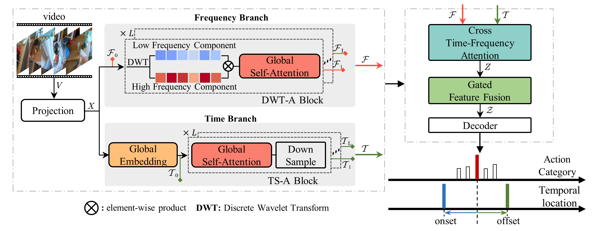

[TCSVT 2023] TFFomer: Cross Time-Frequency Transformer for Temporal Action Localization

# TFFormer: Cross Time-Frequency Transformer for Temporal Action Localization

### Introduction
This code repo implements TFFormer in _TCSVT 2023_, the first attempt to explore the cross-fusion of multi-scale time and frequency-domain features for temporal action localization. TFFormer achieves an average mAP of 23.2% on Ego4D and 25.6% on EPIC-Kitchens 100, which outperform previous state-of-the-arts by a large margin. It also obtains competitive results on ActivityNet v1.3 and THUMOS14, with an average mAP of 36.2% and 67.8%.

### Data Preparation/Installation/More Details
Please refer to [ActionFormer](https://github.com/happyharrycn/actionformer_release) for more details.
### Training and Evaluation
- Train(Take `epic_slowfast_verb` as an example)
```python 
python ./train.py --config ./configs/epic_slowfast_verb.yaml --output model
```
- Evaluation (Take `epic_slowfast_verb` as an example)
```python
python ./eval.py ./configs/epic_slowfast_verb.yaml ./ckpt/epic_slowfast_verb_model
```

### References
If you are using our code, please consider citing the following paper.
```
@article{yang2023cross,
  title={Cross Time-Frequency Transformer for Temporal Action Localization},
  author={Yang, Jin and Wei, Ping and Zheng, Nanning},
  journal={IEEE Transactions on Circuits and Systems for Video Technology},
  year={2023},
  publisher={IEEE}
}
```

```
@inproceedings{zhang2022actionformer,
  title={ActionFormer: Localizing Moments of Actions with Transformers},
  author={Zhang, Chen-Lin and Wu, Jianxin and Li, Yin},
  booktitle={European Conference on Computer Vision},
  series={LNCS},
  volume={13664},
  pages={492-510},
  year={2022}
}
```

#### The implementation of this code is built upon [ActionFormer](https://github.com/happyharrycn/actionformer_release), and we would like to express gratitude for the open-source contribution of [ActionFormer](https://github.com/happyharrycn/actionformer_release).
